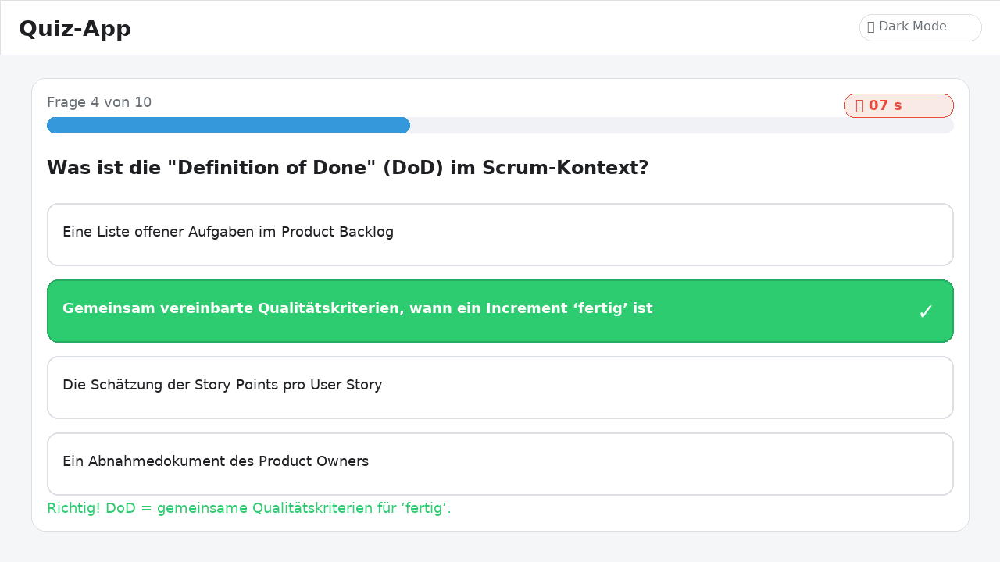

# Das Agile Softwareentwicklungs-Quiz

Ein leichtgewichtiges, responsives **Agile-Quiz** (Deutsch) mit **Timer**, **Punktestand**, **Fortschrittsbalken**, **Dark‑Mode** und **zufälliger Fragenauswahl** – alles in **einer HTML‑Datei** (kein Build, keine Abhängigkeiten).


---

## ✨ Features
- **10 Fragen** zu Agilen Grundlagen (Scrum, PO, SM, MVP etc.) – leicht erweiterbar im `questions`‑Array
- **Zufällige Fragenauswahl** ohne Wiederholung je Durchlauf
- **15‑Sekunden Timer** pro Frage + Auto‑Auswahl bei Timeout
- **Sichtbares Feedback** (richtig/falsch), **Score** und **Restart**
- **Fortschrittsbalken** + „Frage X von Y“
- **Dark‑Mode** per Button (persistiert nicht – sofort umschaltbar)
- **Responsive** CSS für Tablet/Phone

---

## 🧠 So funktioniert’s (Kurzüberblick)
- Fragen werden aus dem `questions`‑Array zufällig gezogen und nach dem Stellen entfernt (keine Duplikate).
- Die Antworten sind **Buttons**; nach Klick werden alle deaktiviert, die korrekte Antwort wird markiert.
- Ein 15s‑Timer läuft pro Frage. Läuft er ab, wird automatisch die richtige Antwort markiert.
- **Score** zählt korrekte Antworten. Am Ende erscheint „Quiz beendet“ mit Ergebnis und „Nochmal spielen“.
- Ein **Fortschrittsbalken** visualisiert den Anteil bereits gestellter Fragen.
- Ein **Dark‑Mode‑Toggle** wechselt Styles in `body.dark`.

---

## Quickstart
1. Repo klonen oder ZIP laden
2. `index.html` doppelklicken (oder im Editor mit *Live Server* öffnen)
3. **Spielen!** Optional: Dark‑Mode testen (Button oben links)


### Screenshot: Ausgewählte/angeklickte Antwort




---

## Anpassen
| Was? | Wo? | Wie? |
|---|---|---|
| **Fragen ergänzen** | `index.html` → `const questions = [...]` | Neue Objekte `{ question, answers:[{text, correct}] }` anhängen |
| **Anzahl Fragen** | `maxQuestions` | Standard `10` – anpassen (≤ Anzahl verfügbarer Fragen) |
| **Timer‑Dauer** | `timeLeft`/`startTimer()` | Standard `15` Sekunden – Wert erhöhen/vermindern |
| **Dark‑Mode‑Texte** | Button‑Beschriftung im Toggle‑Handler | Labels „🌙 Dark Mode“ / „☀️ Light Mode“ anpassen |
| **Farben/Design** | `<style>` | Gradienten/Farben (z. B. #3498db) ändern, eigene Fonts etc. |

> Tipp: Wenn du das Projekt modularisieren willst, extrahiere CSS/JS in `style.css`/`app.js` und binde sie per `<link>`/`<script>` ein.

---

## Projektstruktur
```
.
└── index.html   # Enthält Markup, Styles und Script (keine externen Abhängigkeiten)
```

---

## Deployment (GitHub Pages)
1. **Settings → Pages**  
2. **Source:** *Deploy from a branch* → **Branch:** `main` → **Folder:** `/ (root)` → **Save**  
3. Warte kurz; die öffentliche URL erscheint oben – hier im README bei der Demo verlinken.

---

## Hinweise
- Buttons statt Links → gut bedienbar per Tastatur
- Kontraste im Dark‑Mode beachtet; passe ggf. Farben für AA/AAA an

---

## Tech‑Stack
**HTML5**, **CSS3**, **Vanilla JavaScript** – keine Frameworks, kein Buildsystem

---

## Lizenz
MIT (optional; anpassen nach Bedarf)
